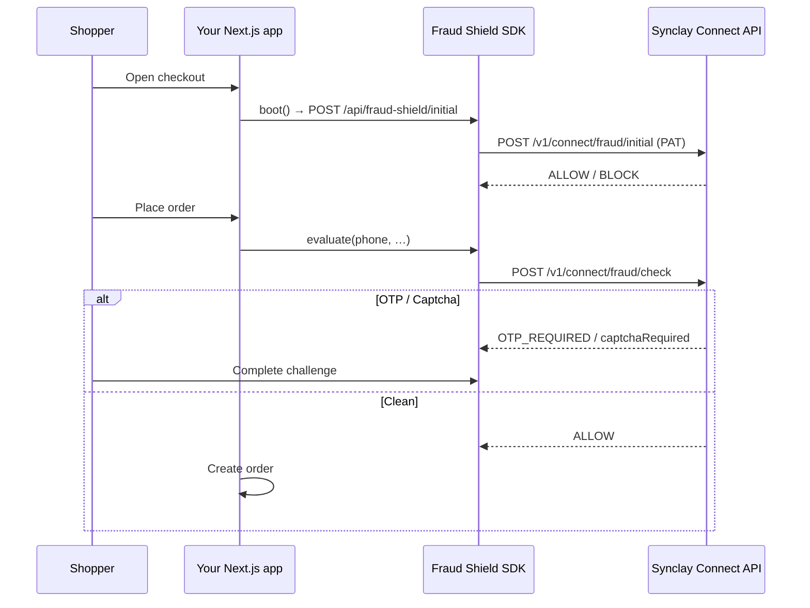

# synclay-fraud-shield

**Synclay Fraud Shield** — drop-in checkout protection for Next.js and modern e-commerce storefronts.

Score every order with Bangladesh courier success rates, device signals, behavior heuristics, OTP, and Turnstile — without building fraud infra yourself.

```bash
npm install synclay-fraud-shield
```

---

## How it works



Your **Personal Access Token stays on the server**. The browser only talks to your Next.js route handlers.

---

## 1. Environment

```env
# Server only — never NEXT_PUBLIC_
SYNCLAY_API_KEY=sc_live_xxxxxxxx
SYNCLAY_SHOP_ID=your_shop_id

# Optional (default https://api.synclay.com)
# SYNCLAY_API_BASE_URL=http://localhost:5001
```

Create a PAT in Synclay with scope **`connect:fraud:read`** (or `connect:*`).

---

## 2. Next.js App Router — one API file

```ts
// app/api/fraud-shield/[action]/route.ts
import { createFraudShieldHandlers } from "synclay-fraud-shield/next";

const handlers = createFraudShieldHandlers({
  apiKey: process.env.SYNCLAY_API_KEY!,
  shopId: process.env.SYNCLAY_SHOP_ID!,
  baseUrl: process.env.SYNCLAY_API_BASE_URL, // optional
});

export const GET = handlers.GET;
export const POST = handlers.POST;
```

Routes created for you:

| Method | Path | Purpose |
|--------|------|---------|
| `GET` | `/api/fraud-shield/config` | Settings + Turnstile site key |
| `POST` | `/api/fraud-shield/initial` | Early IP / blocklist check |
| `POST` | `/api/fraud-shield/check` | Full checkout evaluation |
| `POST` | `/api/fraud-shield/otp-send` | Send OTP |
| `POST` | `/api/fraud-shield/otp-verify` | Verify OTP |
| `POST` | `/api/fraud-shield/captcha-verify` | Verify Turnstile |

---

## 3. Checkout UI

```tsx
// app/checkout/page.tsx  (or your checkout component)
"use client";

import "synclay-fraud-shield/styles.css";
import {
  FraudShieldProvider,
  FraudChallenge,
  FraudHoneypot,
  useFraudShield,
} from "synclay-fraud-shield/react";

function CheckoutForm() {
  const { evaluate, status, sessionToken, blocked } = useFraudShield();

  async function onSubmit(e: React.FormEvent<HTMLFormElement>) {
    e.preventDefault();
    if (blocked) return;

    const fd = new FormData(e.currentTarget);
    const result = await evaluate({
      phone: String(fd.get("phone") || ""),
      email: String(fd.get("email") || ""),
      name: String(fd.get("name") || ""),
      address: String(fd.get("address") || ""),
      orderTotal: Number(fd.get("total") || 0),
    });

    // Wait for OTP / captcha UI if challenged
    if (!result || result.blocked || result.decision !== "ALLOW") return;

    // Attach session token to the order for Synclay learning / analytics
    await fetch("/api/orders", {
      method: "POST",
      headers: { "Content-Type": "application/json" },
      body: JSON.stringify({
        /* …cart… */
        synclaySessionToken: sessionToken,
      }),
    });
  }

  return (
    <>
      <form onSubmit={onSubmit}>
        <input name="phone" data-synclay-field="phone" required />
        <input name="email" data-synclay-field="email" type="email" />
        <input name="name" data-synclay-field="name" />
        <textarea name="address" data-synclay-field="address" />
        <FraudHoneypot />
        <button type="submit" disabled={status === "checking" || blocked}>
          {status === "checking" ? "Securing…" : "Place order"}
        </button>
      </form>

      <FraudChallenge
        phone={/* same phone state */}
        onResolved={() => {
          /* re-submit or continue checkout */
        }}
      />
    </>
  );
}

export default function CheckoutPage() {
  return (
    <FraudShieldProvider>
      <CheckoutForm />
    </FraudShieldProvider>
  );
}
```

Mark checkout inputs with `data-synclay-field` so typing / paste behavior is scored automatically.

---

## 4. Server-only client (no React)

```ts
import { createFraudShield, createFraudShieldFromEnv } from "synclay-fraud-shield";

const shield = createFraudShieldFromEnv();
// or: createFraudShield({ apiKey, shopId })

const result = await shield.check({
  phone: "01712345678",
  sessionToken: "…",
  orderTotal: 1490,
});

if (result.decision === "BLOCK") {
  // reject order
}
```

---

## Package exports

| Import | Use |
|--------|-----|
| `synclay-fraud-shield` | Core client, types, session helpers |
| `synclay-fraud-shield/next` | `createFraudShieldHandlers` |
| `synclay-fraud-shield/react` | Provider, hooks, challenge UI, honeypot |
| `synclay-fraud-shield/styles.css` | Challenge modal styles |

---

## Decisions

| `decision` | Meaning |
|------------|---------|
| `ALLOW` | Safe to place the order |
| `BLOCK` | Reject checkout |
| `OTP_REQUIRED` | Show phone OTP (`FraudChallenge`) |
| `captchaRequired: true` | Show Turnstile |

Scores and signals (`finalScore`, `triggeredSignals`) are returned for logging / admin UI.

---

## Security checklist

- Keep `SYNCLAY_API_KEY` **server-side only**
- Prefer fail-closed settings in the Synclay dashboard for high-risk stores
- Always send `sessionToken` with the created order (`_synclay_session_token` / meta) so Synclay can learn from outcomes
- Never call `api.synclay.com` with your PAT from the browser

---

## Local development

```bash
cd packages/fraud-shield
npm install
npm run build
```

Point `SYNCLAY_API_BASE_URL` at your local API (`http://localhost:5001`) when testing against a local Synclay stack.

---

## License

MIT © Synclay
